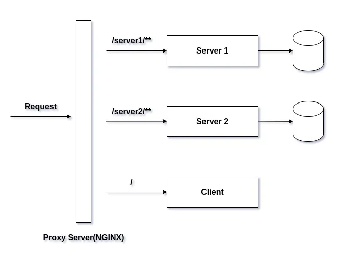

# Using Nginx as a Reverse Proxy for Containerized Node.js Microservices



Inspired from:

- https://javascript.plainenglish.io/using-nginx-as-a-reverse-proxy-for-containerized-node-js-microservices-e7c4800f05a1
- https://github.com/lakshyajit165/nginx_reverse_proxy

Following improvements:

- templated (the variable names come from [`.env`](./nginx/.env) file).
- upgrade to version `18` of `NodeJs`
- version of base Docker images allows to build (no `latest`)

## TLS

Generate certificate for the domain:

```bash
# Import the environment variables
# Inspired from https://medium.com/@TomVance/local-domains-with-https-469036775818
source ./nginx/.env
echo "Will generate a certificate for: '${NGINX_SERVER_NAME}'"
cd nginx/certs
mkcert "*.${NGINX_SERVER_NAME}"
```